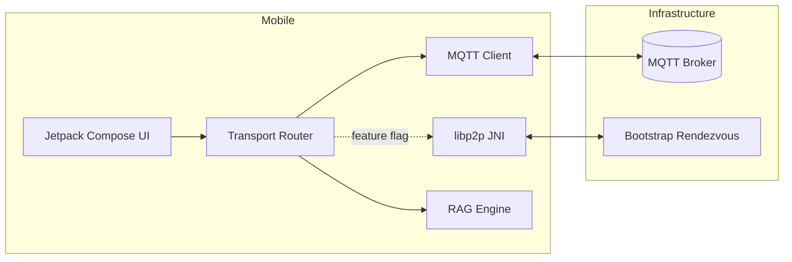

# NodeIQ Architecture

NodeIQ is a mobile-first decentralized knowledge network that combines MQTT reliability with a feature-flagged libp2p direct transport. The architecture is split across Android, Rust, and infrastructure components.

## Data Flow

1. Users browse available peers via retained presence announcements on MQTT.
2. Queries are published to `/query/{agent_id}` topics and responses stream on `/response/{query_id}`.
3. Providers run a foreground service that consumes `QUERY_RECEIVED` events and emits token deltas via the stubbed `RagEngine`.
4. Phase-2 enables libp2p over QUIC for peer-to-peer paths using JNI bindings to the Rust core.

## Components

- **Android App** – Kotlin, Compose UI, Hilt DI, WorkManager, and Firebase Messaging for wake-up signals.
- **Transport Router** – selects MQTT or libp2p based on configuration. MQTT is default for MVP.
- **Rust Core** – libp2p implementation packaged as `libnodeiq_p2p.so` via JNI-friendly C API.
- **Bootstrap Node** – rendezvous and relay service for libp2p discovery.
- **MQTT Broker** – Mosquitto with TLS mutual authentication.

## Persistence & Telemetry

Room persists peers and streaming transcript deltas. Telemetry hooks capture transport metrics and can be extended to OTLP exporters.
