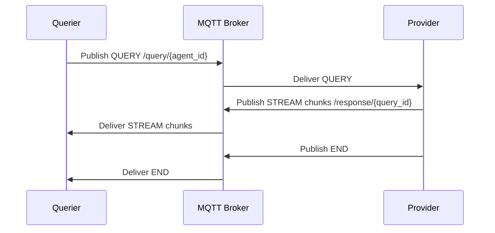

# NodeIQ Protocol

## MQTT JSON Frames (`/kmarket/1.0.0`)

All MQTT payloads use JSON with the following frames:

### QUERY
```json
{
  "version": "1.0",
  "type": "QUERY",
  "query_id": "uuid-...",
  "from_peer": "12D3...",
  "agent_id": "ford_mech",
  "query_text": "P0305 on F-150",
  "ttl_ms": 45000
}
```

### STREAM
```json
{
  "version": "1.0",
  "type": "STREAM",
  "query_id": "uuid-...",
  "seq": 2,
  "delta": "...token..."
}
```

### END
```json
{
  "version": "1.0",
  "type": "END",
  "query_id": "uuid-...",
  "status": "SUCCESS"
}
```

## libp2p Protobuf (`/kmarket/1.0.0`)

The libp2p transport uses the protobuf schema defined in [`proto/kmarket.proto`](../rust/core_p2p/proto/kmarket.proto). Messages are exchanged over a request-response protocol layered on QUIC + Noise.

## Sequence



libp2p Phase-2 mirrors this flow by replacing the broker with a direct QUIC channel discovered through the rendezvous service.
